# Unified Analysis Report

This report summarizes the analyses reconstructed from the bundled result logs. It is descriptive and limited to what can be computed directly from the current repository artifacts.

## Data Coverage

| phase                   |   unique_models |
|:------------------------|----------------:|
| phase_1                 |              14 |
| phase_2_statements_only |              14 |
| phase_3                 |              31 |
| phase_4                 |              15 |

## Phase 1 Hardware Invariance

Matched models: 14

- Mean curve similarity: 1.0000
- Median absolute delta difference: 0.0000
- Worst absolute delta difference: 0.0001

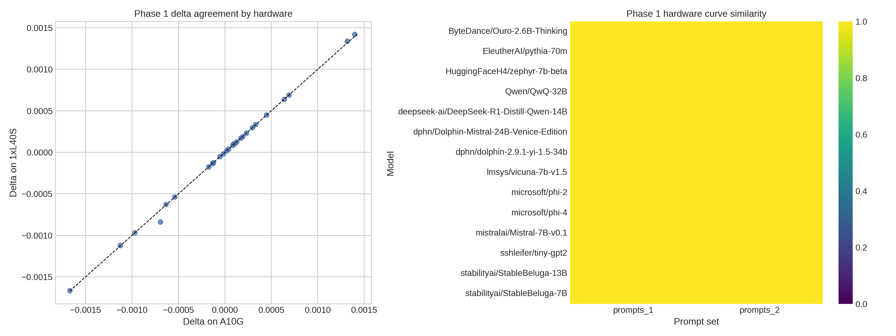

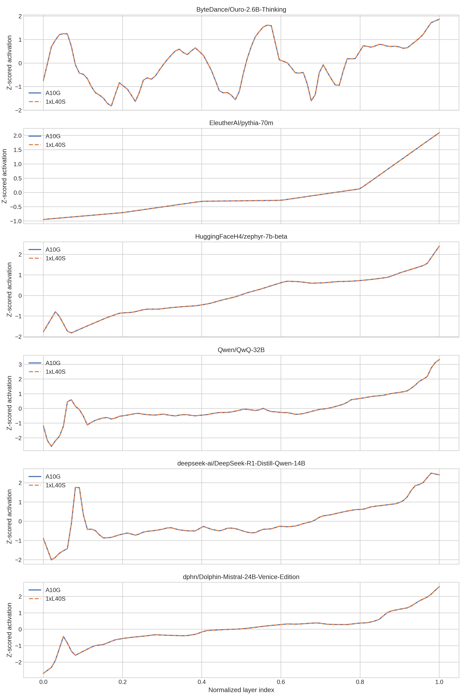

## Phase 1 Prompt-Pattern Invariance

Matched models: 14

- Mean delta-curve similarity: 0.6552
- Delta rank Spearman correlation: 0.5758

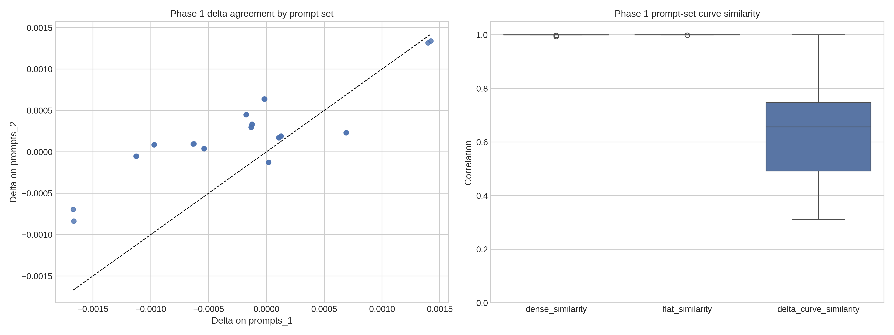

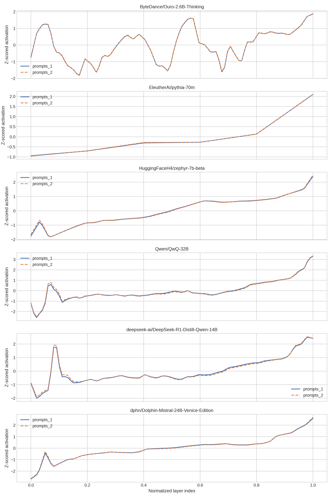

## Phase 3 Normative And Overlay Analyses

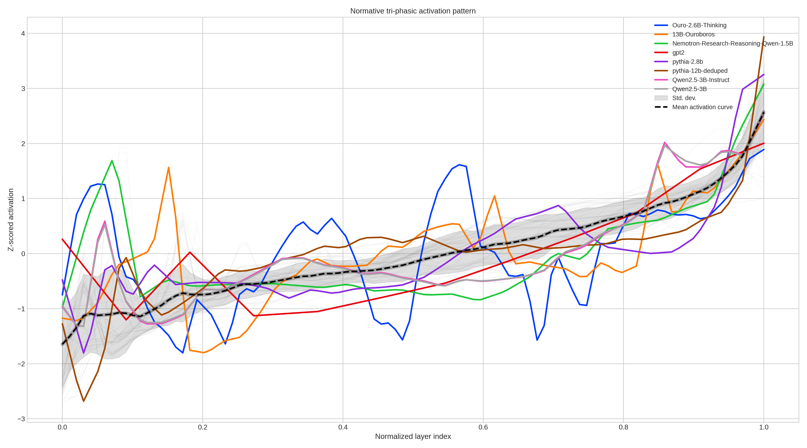

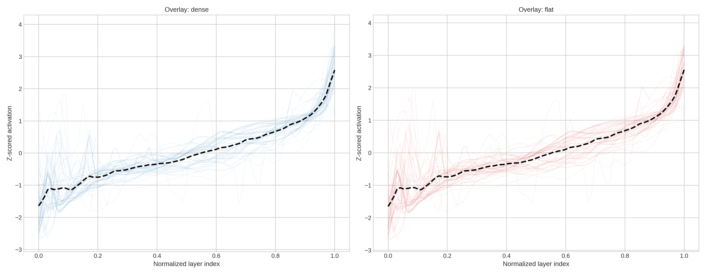

### Highest deviation models

| model_id                                     | model_family   | alignment_status   |   params_b |   norm_band_deviation |
|:---------------------------------------------|:---------------|:-------------------|-----------:|----------------------:|
| ByteDance/Ouro-2.6B-Thinking                 | Other          | base               |     2.6000 |                2.1026 |
| CalderaAI/13B-Ouroboros                      | Other          | base               |    13.0000 |                1.5787 |
| nvidia/Nemotron-Research-Reasoning-Qwen-1.5B | Qwen           | base               |     1.5000 |                1.3285 |
| openai-community/gpt2                        | Other          | instruct           |     0.1200 |                1.3233 |
| EleutherAI/pythia-2.8b                       | Pythia         | base               |     2.8000 |                1.2958 |
| EleutherAI/pythia-12b-deduped                | Pythia         | base               |    12.0000 |                1.2931 |
| Qwen/Qwen2.5-3B-Instruct                     | Qwen           | instruct           |     3.0000 |                1.0873 |
| Qwen/Qwen2.5-3B                              | Qwen           | base               |     3.0000 |                1.0768 |
| EleutherAI/pythia-1.4b-deduped               | Pythia         | base               |     1.4000 |                0.9697 |
| openai-community/gpt2-medium                 | Other          | instruct           |     0.3500 |                0.9663 |

## Phase 3 PCA

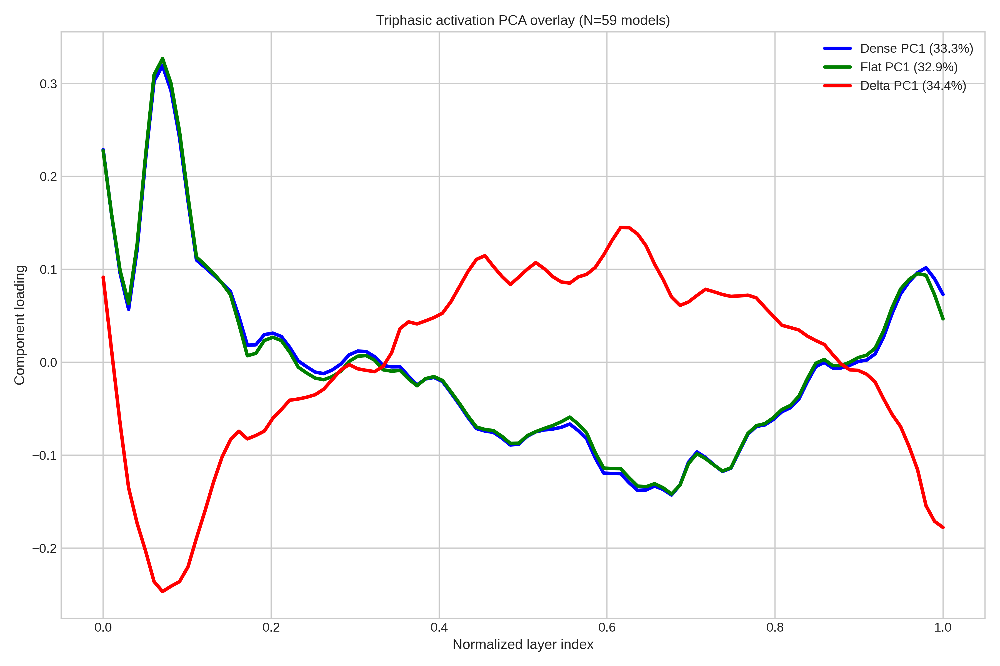

| curve_type   |   pc1_explained_variance_ratio |
|:-------------|-------------------------------:|
| dense        |                         0.3325 |
| flat         |                         0.3292 |
| delta        |                         0.3441 |

## Phase 3 Training Emergence

### OLMo

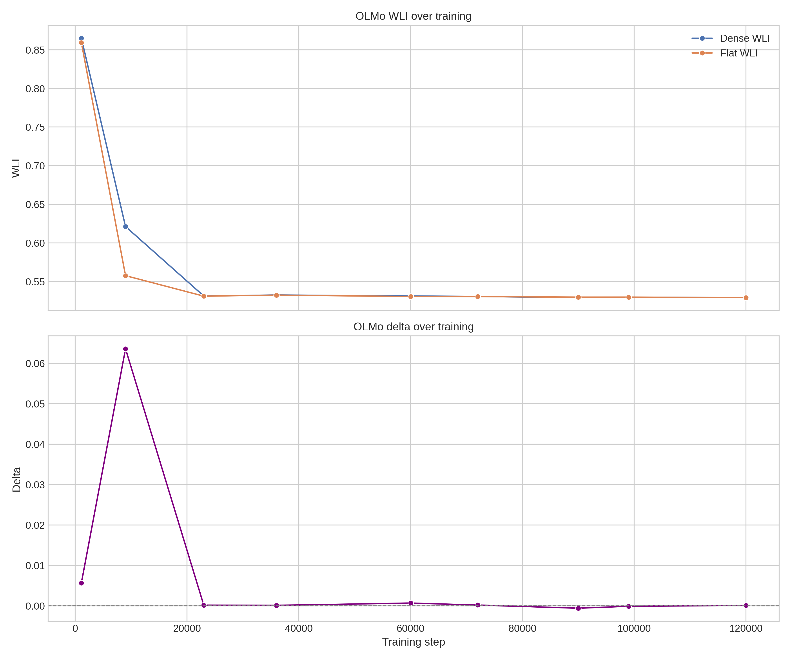

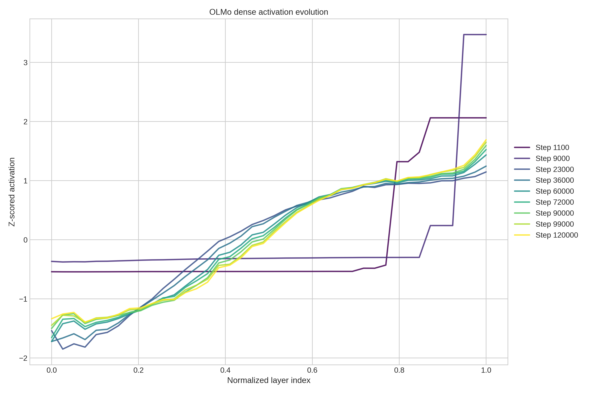

### Pythia

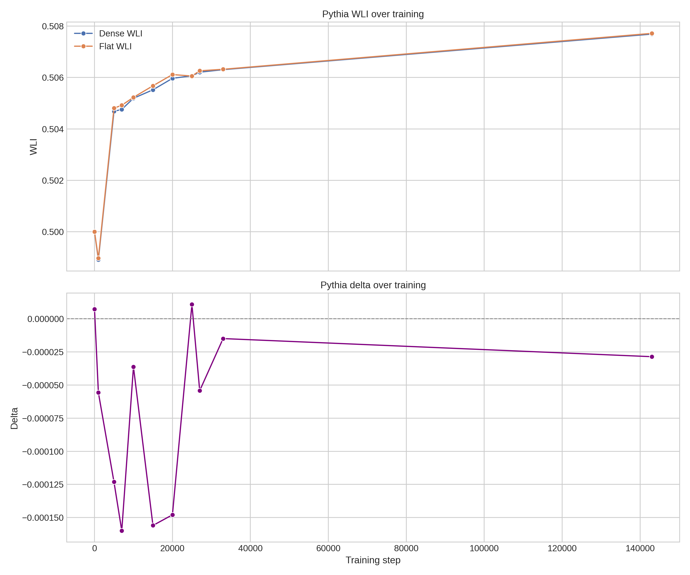

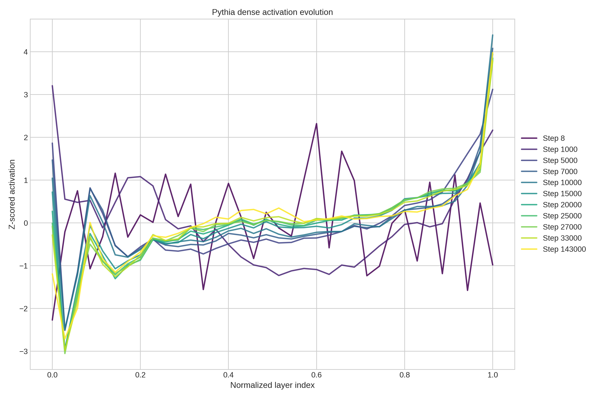
